# 1. This is an absolute path.
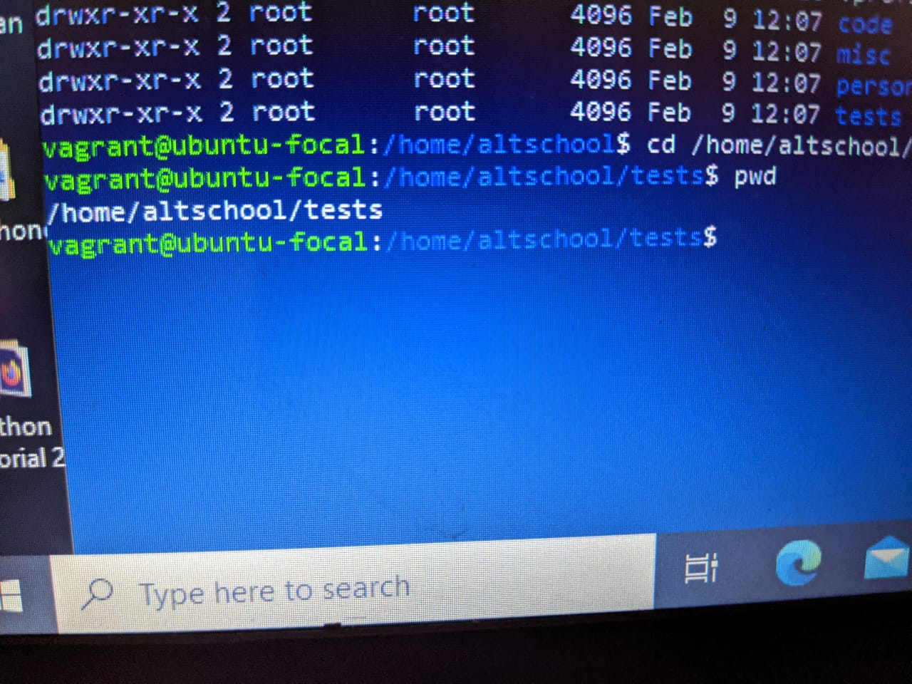
# 2. This command forces the user to change their password upon login
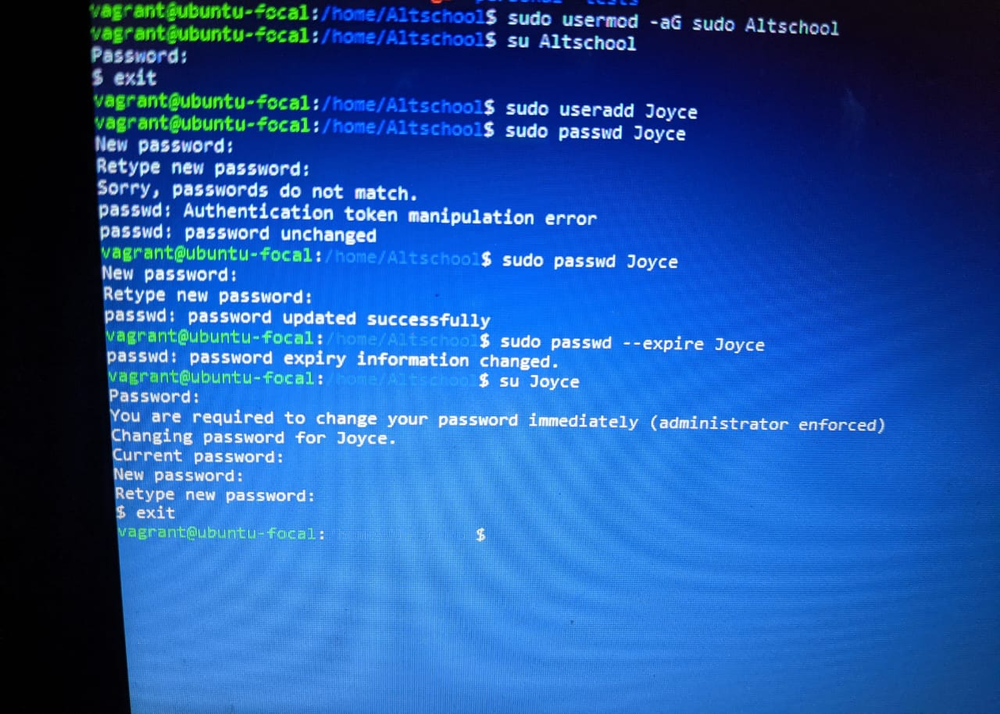
# 3. I made use of the echo command to create a file containing Hello A.
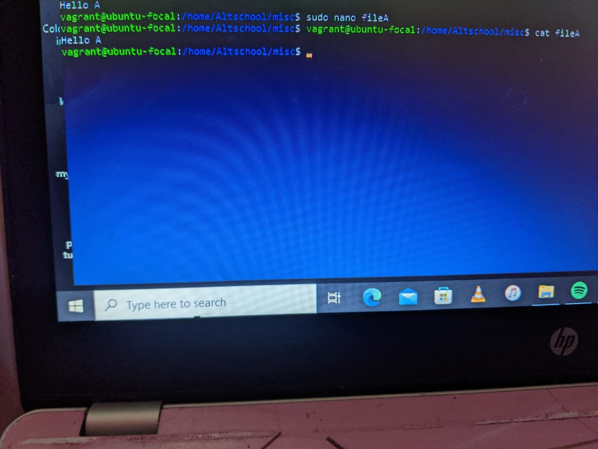
# 4. I created a file named file B and filled it with dummy contents.
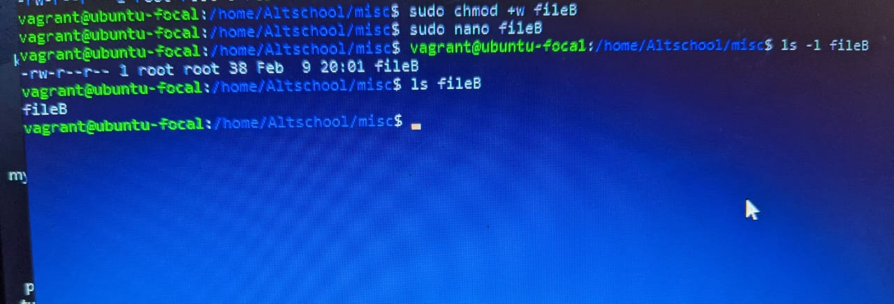
# 5. File A was copied into file C.
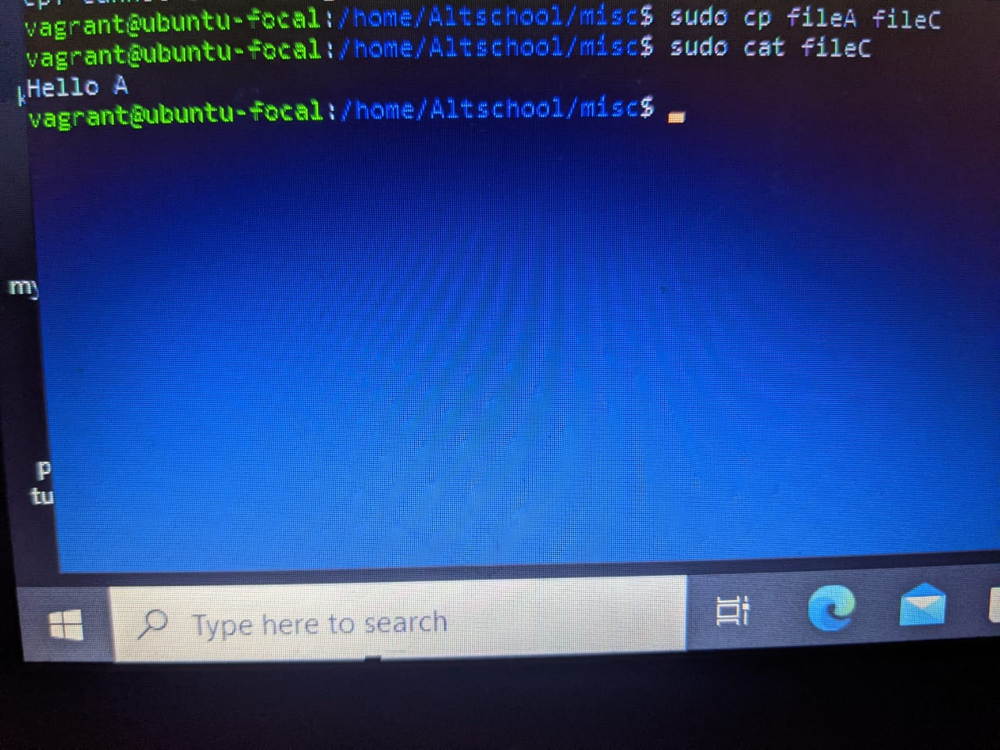
# 6. File B content was moved into file D.
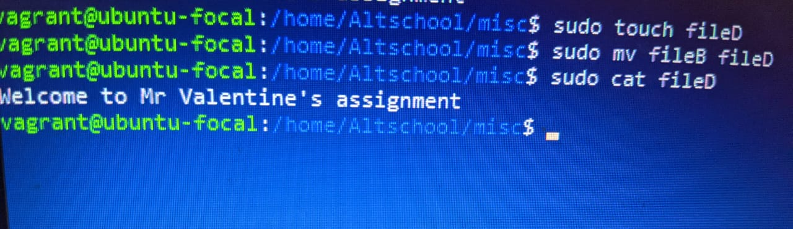
# 7. The altschool home directory was created.
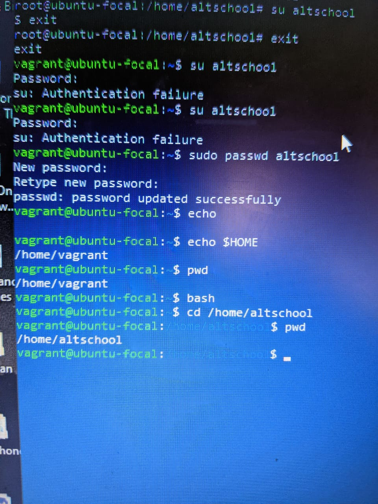
# 8. This command locks a user's password.
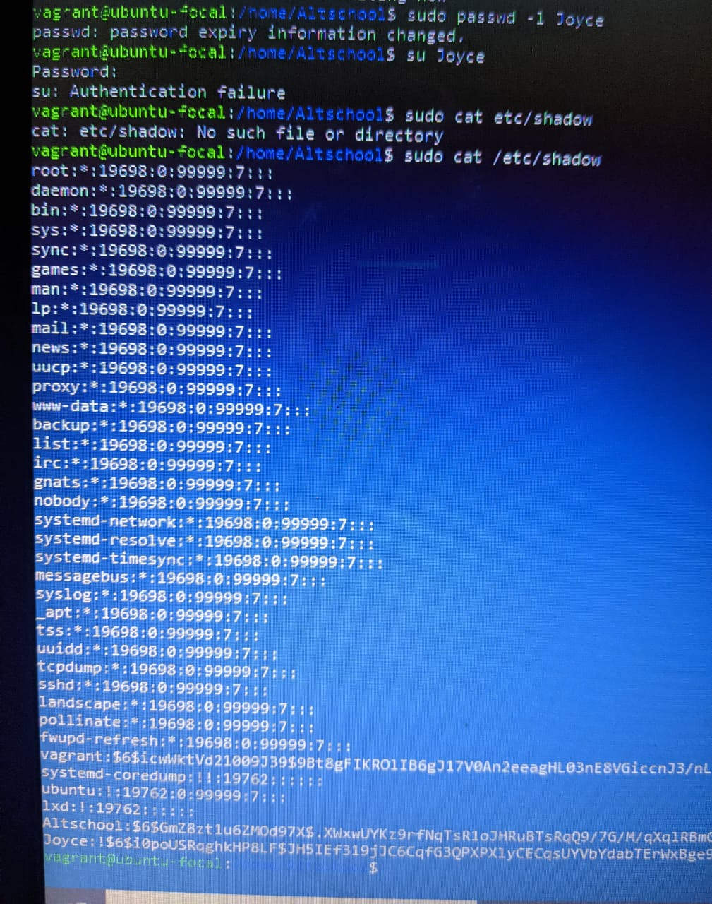
# 9. I created the following subdirectories code, tests, personal, and misc.
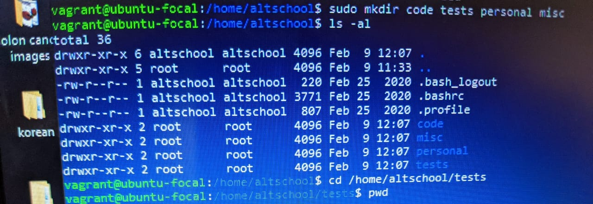
# 10. I used this command to compress the tar archive.
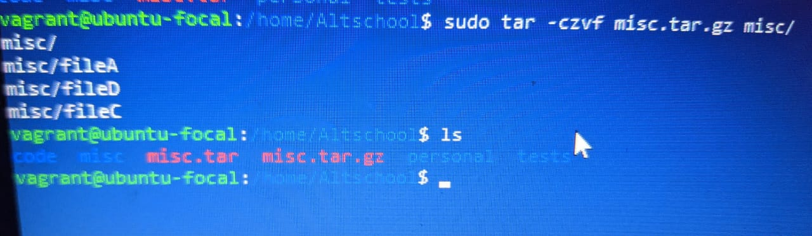
# 11. A tar archive was created here called misc.tar
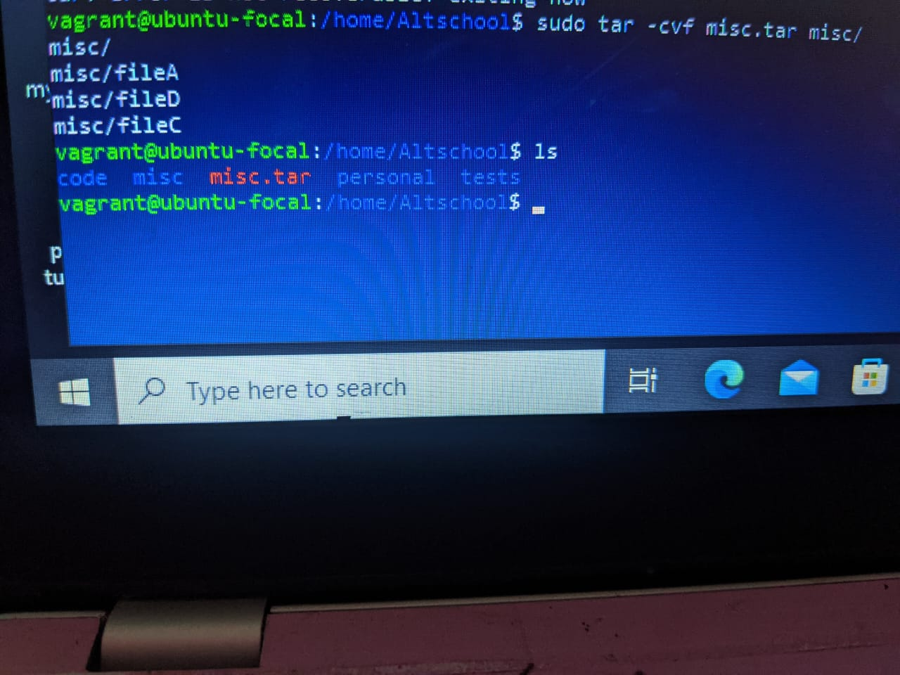
# 12. This command was used to create a user with no login shell.
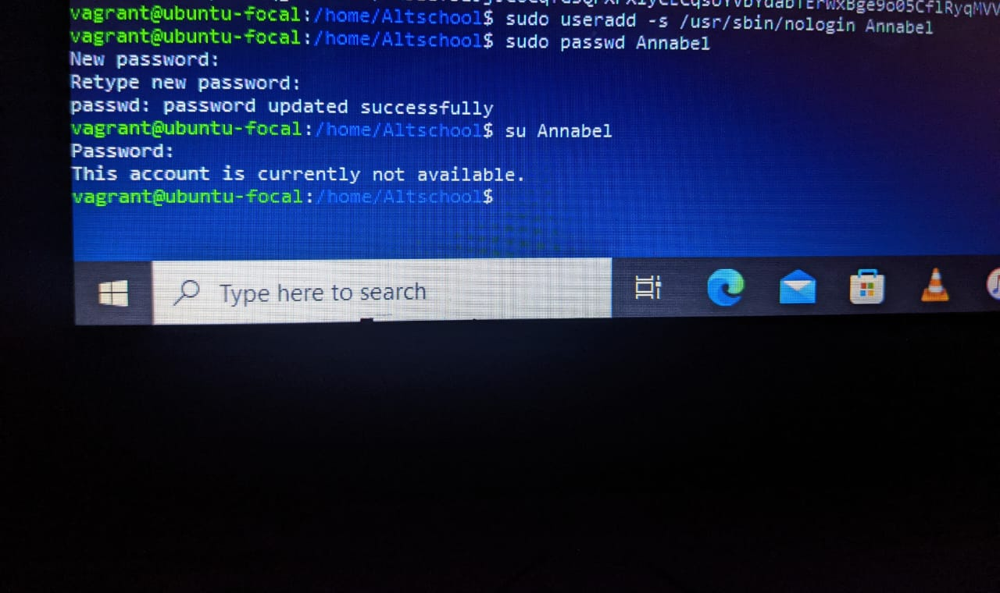
# 13. I disabled the password-based authentication for ssh.
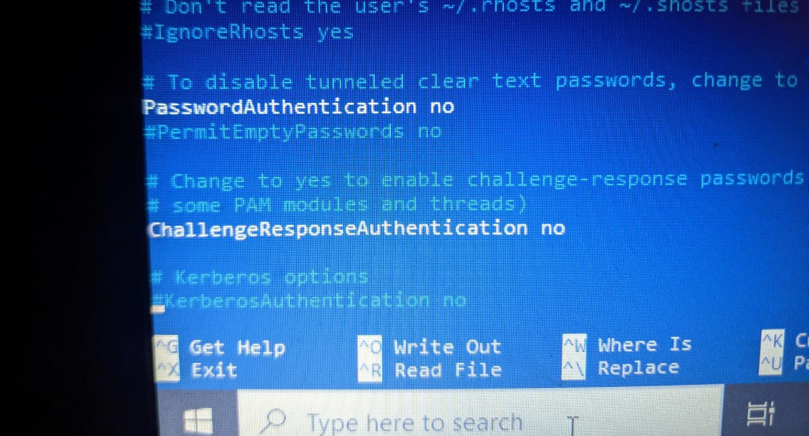
# 14. I disabled the root login for ssh.
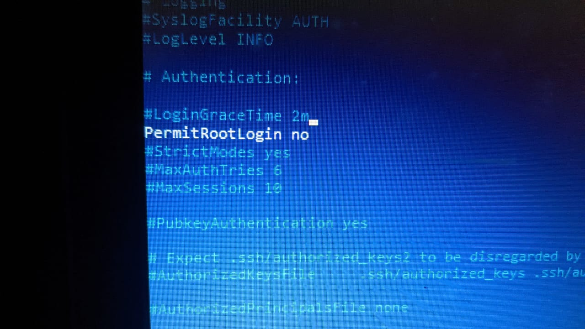
# 15. Using the relative path name, I switched to the tests directory.
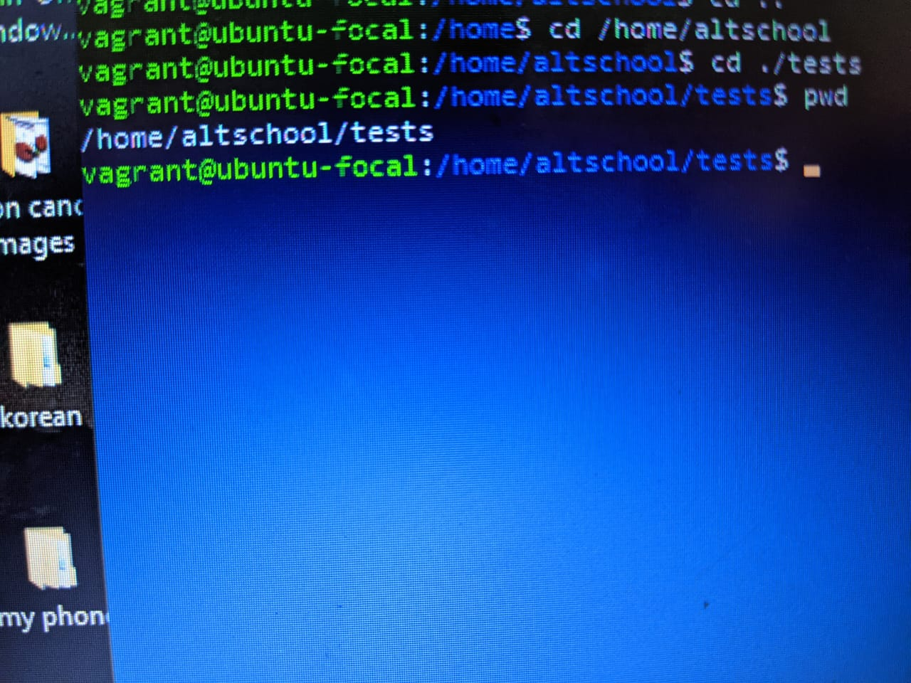
